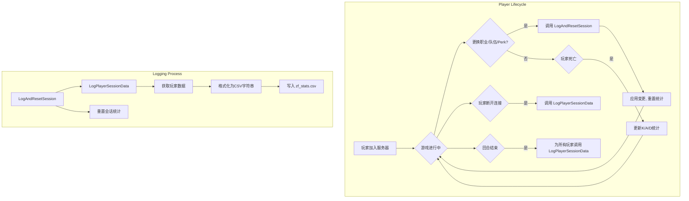

# 僵尸要塞（Zombie Fortress）统计系统重构计划

## 1. 目标

将现有的 `zf_stats.log` 日志系统升级为详细的CSV格式日志，记录玩家在更换队伍、职业或Perk时的详细游戏数据。

## 2. CSV文件格式

**文件名**: `logs/zf_stats.csv`

**表头 (Header)**:
`user,steamid,team,class,perk,kill,assist,death,lastattack,lastspeed,lastcritchance,lastrof,lastdefense`

## 3. 实施步骤

### 步骤一：数据结构准备 (在 `zombie_fortress_perk.sp` 中)

1.  **定义新的全局变量**: 用于追踪玩家在单个“会话”（即两次状态变更之间）的统计数据。
    ```sourcepawn
    // 用于CSV日志记录的会话统计
    int g_iSessionKills[MAXPLAYERS + 1];
    int g_iSessionAssists[MAXPLAYERS + 1];
    int g_iSessionDeaths[MAXPLAYERS + 1];
    ```
2.  **初始化与重置**:
    *   在 `OnPluginStart` 中初始化这些数组为0。
    *   在 `event_RoundStart` 中为所有玩家重置这些会话统计数据。

### 步骤二：实现核心统计与日志功能 (在 `zombie_fortress_perk.sp` 中)

1.  **更新事件处理器**:
    *   修改 `event_PlayerDeath` 函数，在现有逻辑基础上，为击杀者、助攻者和受害者分别累加 `g_iSessionKills`, `g_iSessionAssists`, `g_iSessionDeaths`。

2.  **创建CSV日志写入函数**:
    *   `stock void WriteCsvHeader()`: 检查 `zf_stats.csv` 文件是否存在。如果不存在，则创建文件并写入表头。此函数应在 `OnPluginStart` 中调用。
    *   `void LogPlayerSessionData(int client)`:
        *   获取所有需要记录的数据（玩家信息、会话K/A/D、通过 `getStat` 获取的各项属性）。
        *   处理玩家名中的逗号，进行转义（例如，替换为分号或用引号包裹）。
        *   将数据格式化为单行CSV字符串。
        *   使用 `LogToFile` 将该行数据追加到 `logs/zf_stats.csv`。

3.  **创建日志触发与数据重置函数**:
    *   `public void LogAndResetSession(int client)`:
        *   调用 `LogPlayerSessionData(client)` 记录当前数据。
        *   重置该玩家的会话统计数据 (`g_iSessionKills[client]`, `g_iSessionAssists[client]`, `g_iSessionDeaths[client]`) 为0。
        *   **注意**: 此函数需要声明为 `public`，以便在 `.inc` 文件中调用。

### 步骤三：在关键事件节点调用日志记录

1.  **更换队伍/职业**:
    *   在 `hook_JoinTeam` 和 `hook_JoinClass` 函数的开头，检查玩家请求的新队伍/职业是否与当前不同。如果是，则调用 `LogAndResetSession(client)`。
    *   在 `timer_zombify` 函数中，因为这是强制换队，直接在 `spawnClient` 之前调用 `LogAndResetSession(client)`。

2.  **更换Perk (在 `zf_perk.inc` 中)**:
    *   在 `perk_OnPlayerSpawn` 函数中，找到 `perkChange = true;` 的逻辑块。在此逻辑块内部，调用 `LogAndResetSession(client)`。这是最准确的Perk变更时机。

3.  **玩家离开与回合结束**:
    *   在 `OnClientDisconnect` 中，调用 `LogPlayerSessionData(client)`（**注意**：此处不重置数据，只记录最终状态）。
    *   在 `event_RoundEnd` 中，遍历所有在线玩家，调用 `LogPlayerSessionData(client)`，确保所有玩家本回合的最终数据都被记录。

## 4. Mermaid流程图



## 5. 总结

该计划通过引入“会话”统计变量，并在所有状态变更的关键节点插入日志记录和重置逻辑，确保了数据的准确性和完整性。将核心日志功能封装在独立的函数中，提高了代码的可维护性。
